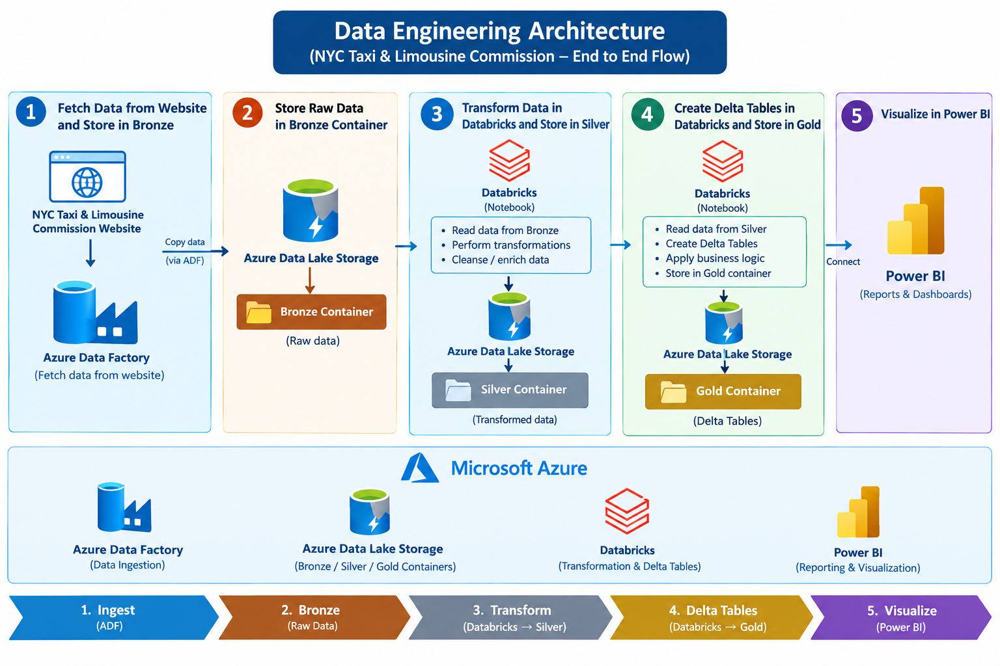

# 🚕 NYC Green Taxi Data Engineering Project

## 📌 Project Overview

This is an end-to-end **Azure Data Engineering project** built to investigate an unexplained drop in **Green Taxi revenue in 2025**.

The pipeline collects data from the **NYC Taxi & Limousine Commission**, processes it using Azure services, and provides business-ready data to analysts through Power BI.

---

## 🎯 Problem Statement

The company manager noticed a significant drop in **Green Taxi booking revenue in 2025** and asked for a data pipeline to provide reliable data for analysis.

The solution follows a **Medallion Architecture**:

**Bronze → Silver → Gold → Power BI**

---

## 🏗️ Architecture

```text
NYC TLC Website
      ↓
Azure Data Factory
      ↓
Azure Data Lake
   Bronze Layer
      ↓
Azure Databricks
   Transformation
      ↓
Azure Data Lake
   Silver Layer
      ↓
Azure Databricks
  Delta Table
      ↓
Azure Data Lake
    Gold Layer
      ↓
    Power BI
      ↓
Analysts & Business Users
```

### Architecture Diagram


```markdown

```

---

## 🔄 Pipeline Steps

### 1. Data Ingestion

**Azure Data Factory** fetches the Green Taxi dataset from the NYC Taxi & Limousine Commission website and loads it into Azure Data Lake Storage.

### 2. Bronze Layer

The original/raw dataset is stored in the **Bronze container** without major transformations.

### 3. Silver Layer

**Azure Databricks** reads the Bronze data and performs data cleaning and transformations using **PySpark**. The processed data is stored in the **Silver container**.

### 4. Gold Layer

Databricks reads the Silver data and creates a **Delta Table** containing business-ready Green Taxi data. The table is stored in the **Gold container**.

### 5. Power BI

The Gold data is connected to **Power BI** to create reports and dashboards that help analyze the 2025 revenue decline.

---

## 🛠️ Technologies Used

| Technology                   | Purpose                   |
| ---------------------------- | ------------------------- |
| Azure Data Factory           | Data ingestion            |
| Azure Data Lake Storage Gen2 | Data storage              |
| Azure Databricks             | Data transformation       |
| PySpark                      | Data processing           |
| Delta Lake                   | Gold Delta Table          |
| Power BI                     | Reporting & visualization |

---

## 📊 Business Objective

The final Power BI dashboard can be used to analyze:

* Revenue trends
* Monthly bookings
* Trip distance
* Fare amount
* Tip amount
* Pickup/drop-off locations
* Payment types

This helps the business understand **what factors contributed to the Green Taxi revenue decline in 2025**.

---


---

## 👨‍💻 Author

**Prashant More**

**Azure Data Engineering Project**

Azure Data Factory | Azure Data Lake | Azure Databricks | PySpark | Delta Lake | Power BI
